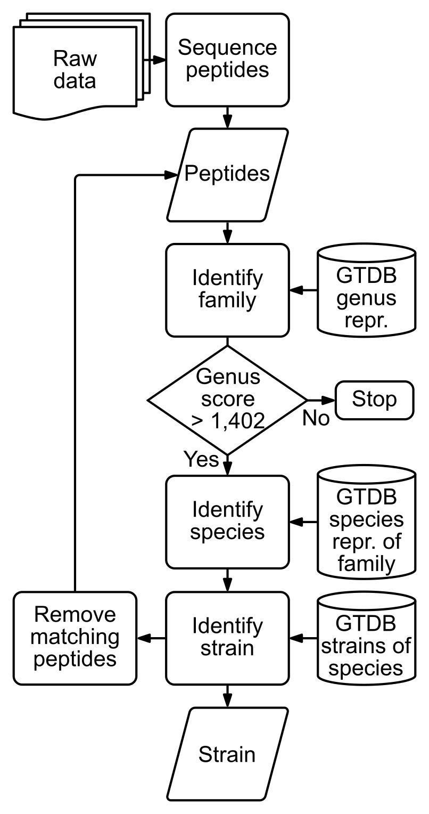

# NovoTax: prokaryotic strain identification from mass spectrometry-based proteomics data

Welcome! If you find any issues with this first release, please do not hesitate to open an issue or contact us directly (`dennis.svedberg at umu.se`)

## What is NovoTax?



**NovoTax** is a modular pipeline for identifying prokaryotic strains from mass spectrometry-based proteomics data.

The full NovoTax workflow is designed to go from raw proteomics data to taxonomic assignment and a sample-specific protein database for downstream analysis.

## Why use it?

NovoTax is meant to be practical and accessible:

- one sample sheet
- one command to run
- containerized tools for reproducibility
- designed so non-experts can use it with minimal setup

## Pipeline setup

For more detailed instructions, please refer to the documentation:

- [`Intro`](docs/intro.md)
- [`Installation`](docs/installation.md)
- [`Usage`](docs/usage.md)
- [`Example`](docs/example.md)

## Quick start

### 1. What you need

You need:

- **Nextflow**
- **Apptainer** or **Docker**
- a **tab-separated sample sheet**

### 2. Sample sheet format

Create a tab-separated file like this:

| file_path                                | data_format |
|------------------------------------------|-------------|
| /full/path/to/folder/demo_xuanjinovo.mgf | dda         |
| /full/path/to/folder/demo_cascadia.mzML  | dia         |

### 3. Run the pipeline

```bash
nextflow run main.nf \
  --input /path/to/samples.tsv \
  --output_dir /path/to/results \
  --model_file /path/to/model.ckpt
```

## Output
NovoTax creates one folder for each experiment, creating a folder structure as follows:
```
├── demo_xuanjinovo
│   ├── demo_xuanjinovo_genus_scores.png    - Graph showing the genus scores of all strains found in sample
│   ├── demo_xuanjinovo_peptides.txt        - All peptides in the sample over scoring threshold (0.8 default)
│   ├── demo_xuanjinovo_strains.fasta       - Fasta containing the concatenated proteomes of all strains found
│   └── results.tsv                         - Extended NovoTax output
├── demo_cascadia
│   ├── demo_cascadia_genus_scores.png
│   ├── demo_cascadia_peptides.txt
│   ├── demo_cascadia_strains.fasta
│   └── results.tsv
```


## Cite

If you use **NovoTax**, please cite the tools that make this possible:

**NovoTax**  
Svedberg D, Mateus A.  
*NovoTax: prokaryotic strain identification from mass spectrometry-based proteomics data.*  
bioRxiv. 2026.  
DOI: https://doi.org/10.64898/2026.04.02.715787

**Cascadia**  
Sanders J, Wen B, Rudnick PA, et al.  
*A transformer model for de novo sequencing of data-independent acquisition mass spectrometry data.*  
Nat Methods. 2025;22:1447–1453.  
DOI: https://doi.org/10.1038/s41592-025-02718-y

**XuanjiNovo**  
Jun A, Zhang X, et al.  
*MassNet: billion-scale AI-friendly mass spectral corpus enables robust de novo peptide sequencing.*  
bioRxiv. 2025.  
DOI: https://doi.org/10.1101/2025.06.20.660691

**MMseqs2**  
Steinegger M, Söding J.  
*MMseqs2 enables sensitive protein sequence searching for the analysis of massive data sets.*  
Nat Biotechnol. 2017;35:1026–1028.  
DOI: https://doi.org/10.1038/nbt.3988

**GTDB**  
Parks, D.H., et al.  
*GTDB release 10: a complete and systematic taxonomy for 715 230 bacterial and 17 245 archaeal genomes*  
Nucleic Acids Research, 2025.  
DOI: https://doi.org/10.1093/nar/gkaf1040
