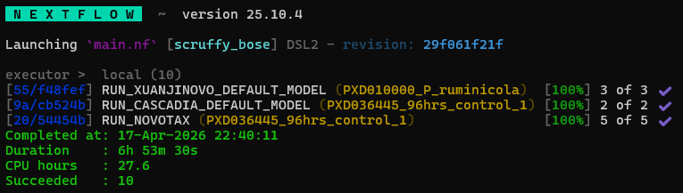
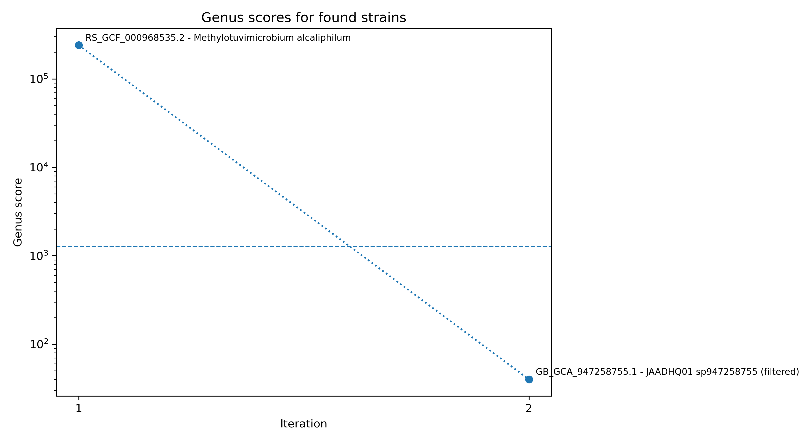
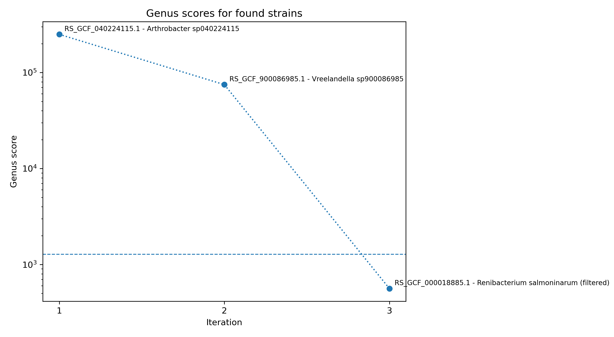
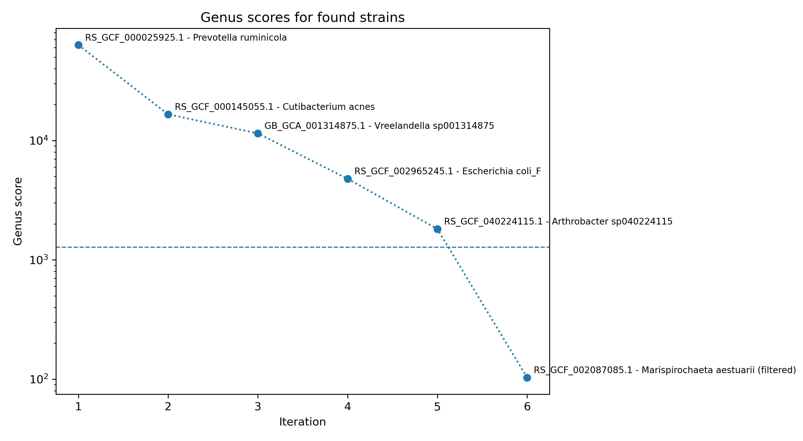
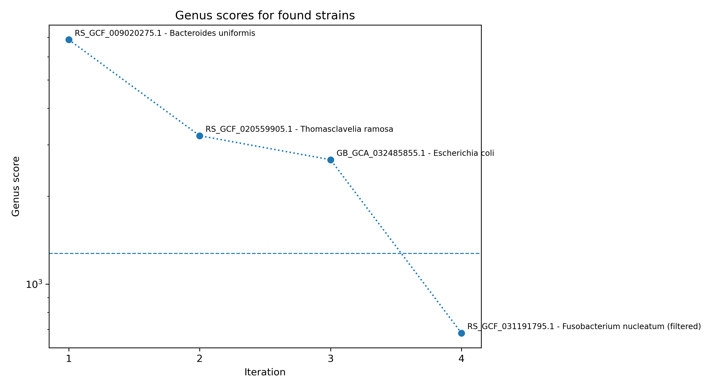

# Example run

## Data

The following example contains all the commands to run a subset of the analysis performed in the paper. They were chosen to be representative of the different datatypes (DDA / DIA) and different findings. It consists of five files:
* **M_alcali_copp_MeOH_B2_T2_04_QE_23Mar18_Oak_18-01-07.mgf** - From [PXD010000](https://www.ebi.ac.uk/pride/archive/projects/PXD010000), DDA data with no detected contamination
* **Biodiversity_HL93_HLHfructose_aerobic_3_09Jun16_Pippin_16-03-39.mgf** - From [PXD010000](https://www.ebi.ac.uk/pride/archive/projects/), DDA data with two species detected (one probable contamination)
* **Biodiversity_P_ruminicola_MDM_anaerobic_1_09Jun16_Pippin_16-03-39.mgf** - From [PXD010000](https://www.ebi.ac.uk/pride/archive/projects/), DDA data with multiple species detected as probable contamination 
* **20181112_QX8_PhGe_SA_EasyLC12-14_B_a8_221_TP96hrs_control_rep1.mzML** & **20181112_QX8_PhGe_SA_EasyLC12-12_B_a6_222_TP96hrs_control_rep2.mzML** - From [PXD036445](https://www.ebi.ac.uk/pride/archive/projects/PXD036445), DIA data from complex community. Highlights using multiple files from one experiment.

These files are [deposited to Zenodo](https://zenodo.org/records/19495971) and will be downloaded when running the example script.

## Running the example
First, please [verify that the environment is working correctly](installation.md#3-verify-the-environment-with-gpu-support) and [that the databases are setup](installation.md#4-setting-up-novotax). A guide showing the expected output and analysis of this is extended example is then included below.

Start by downloading the data:
```bash
bash scripts/setup_example_data.sh
```

The example can then be run, [after making sure you set the appropriate flags and paths for your system](usage.md#flags), with:
```bash
nextflow run main.nf -profile apptainer_wsl_gpu --input examples/samples_extended.tsv --output_dir extended_example_results/ --gtdb_protein_reps /data/dbs/gtdb/release226/protein_faa_reps --gtdb_db_dir novotax_db_r226
```

## Expected output

A successful run will look something like this:  


With the results folder structure being:
```
├── extended_example_results
│   ├── PXD010000_M_alcali
│   │   ├── PXD010000_M_alcali_genus_scores.png    - Graph showing the genus scores of all strains found in sample
│   │   ├── PXD010000_M_alcali_peptides.txt        - All peptides in the sample over scoring threshold (0.8 default)
│   │   ├── PXD010000_M_alcali_strains.fasta       - Fasta containing the concatenated proteomes of all strains found
│   │   └── results.tsv                             - Extended NovoTax output
│   ├── PXD010000_HL93
│   │   ├── PXD010000_HL93_genus_scores.png
│   │   ├── PXD010000_HL93_peptides.txt
│   │   ├── PXD010000_HL93_strains.fasta
│   │   └── results.tsv
│   ├── PXD010000_P_ruminicola
│   │   ├── PXD010000_P_ruminicola_genus_scores.png
│   │   ├── PXD010000_P_ruminicola_peptides.txt
│   │   ├── PXD010000_P_ruminicola_strains.fasta
│   │   └── results.tsv
│   ├── PXD036445_96hrs_control_1
│   │   ├── PXD036445_96hrs_control_1_genus_scores.png
│   │   ├── PXD036445_96hrs_control_1_peptides.txt
│   │   ├── PXD036445_96hrs_control_1_strains.fasta
│   │   └── results.tsv
│   └── PXD036445_96hrs_control_2
│       ├── PXD036445_96hrs_control_2_genus_scores.png
│       ├── PXD036445_96hrs_control_2_peptides.txt
│       ├── PXD036445_96hrs_control_2_strains.fasta
│       └── results.tsv
```

Below, you can find the results of each sample.

### *M. alcaliphilum*
`M_alcali_copp_MeOH_B2_T2_04_QE_23Mar18_Oak_18-01-07.mgf`




### *H. sp. HL93*
`Biodiversity_HL93_HLHfructose_aerobic_3_09Jun16_Pippin_16-03-39.mgf`  
*Note: Halomonas sp. HL93 has been named Vreelandella sp900086985 in GTDB*



### *P. ruminicola*
`Biodiversity_P_ruminicola_MDM_anaerobic_1_09Jun16_Pippin_16-03-39.mgf`



### B_a8_221_TP96hrs_control_rep1
`Biodiversity_C_Baltica_T240_R3_Inf_27Jan16_Arwen_15-07-13.mgf`


