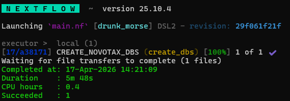
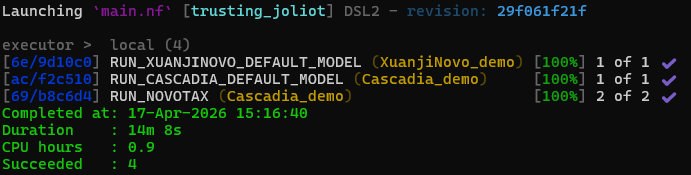

# Installation

NovoTax runs as a [**Nextflow**]((https://www.nextflow.io)) pipeline and uses modular **container images** for its software environment.

To run NovoTax locally, the following tools are needed:

- [**Nextflow**](https://www.nextflow.io)
- [**Apptainer**](https://apptainer.org) or [**Docker**](https://www.docker.com)

## Supported environment

NovoTax is intended to run on:

- **Windows through WSL2**
    - To install Windows Subsystem for Linux (WSL), please follow the [official guide](https://learn.microsoft.com/en-us/windows/wsl/install)
- **Ubuntu**


macOS is not supported due to hardware limitations for de novo sequencers.

## 0. System preparation

Ensure that all package channels are up-to-date:
```bash
sudo apt update
```

## 1.  Install Nextflow

Check whether Nextflow is already available:

```bash
nextflow -version
```

If not, the steps below are enough for a typical installation. If you face problems during this, please refer to the [official documentation](https://docs.seqera.io/nextflow/install).

### Install Java
Nextflow requires Java 17 (or later, up to 26). Check which version of Java you have with:
```bash
java -version
```
If needed, install Java 17 or newer using your system package manager or a JDK distribution of your choice. For example, using:
```bash
sudo apt install -y openjdk-17-jre-headless
```
Confirm Java is installed correctly:
```bash
java -version
```

### Install Nextflow
Download Nextflow:
```bash
curl -s https://get.nextflow.io | bash
```
Make Nextflow executable:
```bash
chmod +x nextflow
```
Move Nextflow into an executable path. For example:
```bash
sudo mv nextflow /usr/local/bin/
```

### Verify installation
Verify that Nextflow is installed correctly:
```bash
nextflow -version
```

## 2. Container platform

NovoTax utilises containerisation for reproducability and modularity. There's two main container platforms supported, Apptainer and Docker. If Docker is already installed [and working](#22-docker) we recommend continuing using that. If this is the first time you use containers or work in an HPC environment we instead recommend Apptainer due to easier installation and usage.

## 2.1 Apptainer

Check if Apptainer is already available:
```bash
apptainer version
```

If not, the steps below is enough for a typical installation. If you face problems during this, please refer to the [official guide](https://apptainer.org/docs/admin/main/installation.html).

### Install Apptainer
```bash
sudo apt install -y software-properties-common
sudo add-apt-repository -y ppa:apptainer/ppa
sudo apt update
sudo apt install -y apptainer
```

### Verify installation
```bash
apptainer version
```

### Extra WSL step
If you're on WSL, you will also need to install the nvidia-container-toolkit to utilise the GPU. Start by adding the libnvidia-container repository to the keyring:
```bash
curl -fsSL https://nvidia.github.io/libnvidia-container/gpgkey | \
  sudo gpg --dearmor -o /usr/share/keyrings/nvidia-container-toolkit-keyring.gpg
```

```bash
curl -fsSL https://nvidia.github.io/libnvidia-container/stable/deb/nvidia-container-toolkit.list | \
  sed 's#deb https://#deb [signed-by=/usr/share/keyrings/nvidia-container-toolkit-keyring.gpg] https://#g' | \
  sudo tee /etc/apt/sources.list.d/nvidia-container-toolkit.list >/dev/null
```

After the addition to the keyring the package can be installed:

```bash
sudo apt-get update
sudo apt-get install -y nvidia-container-toolkit
```

### Verify installation with GPU
**Ubuntu**:
```bash
apptainer exec --nv docker://nvidia/cuda:11.8.0-base-ubuntu22.04 nvidia-smi
```
**WSL**:
```bash
apptainer exec --nvccli docker://nvidia/cuda:11.8.0-base-ubuntu22.04 nvidia-smi
```
If nvidia-smi shows the systems GPU details the Apptainer installation is working correctly with the systems GPUs. You can move on to [verify the setup](#3-verify-the-environment-with-gpu-support) below.

## 2.2 Docker
If you prefer to run Docker, or Docker is already installed on your system, this is also supported. Please make sure that your docker installation can access the systems GPUs with:
```bash
docker run --rm --gpus all nvidia/cuda:11.8.0-base-ubuntu22.04 nvidia-smi
```
If this works, you can move on to [verify the environment](#3-verify-the-environment-with-gpu)! If this does not work, please refer to the official documentation to make sure that [rootless Docker](https://docs.docker.com/engine/security/rootless/) and the [NVIDA Container Toolkit](https://docs.nvidia.com/datacenter/cloud-native/container-toolkit/latest/install-guide.html) is set up correctly.

## 3. Verify the environment with GPU support

Before running NovoTax, make sure the foillowing commands work:

```bash
nextflow -version
```

## If using Apptainer

**Ubuntu**
```bash
apptainer exec --nv docker://nvidia/cuda:11.8.0-base-ubuntu22.04 nvidia-smi
```

**WSL**
```bash
apptainer exec --nv --nvccli docker://nvidia/cuda:11.8.0-base-ubuntu22.04 nvidia-smi
```

## If using Docker
```bash
docker run --rm --gpus all nvidia/cuda:11.8.0-base-ubuntu22.04 nvidia-smi
```

## 4. Setting up NovoTax

### Cloning NovoTax
For full flexibility we recommend cloning NovoTax to your local system and work from within this directory:
```bash
git clone https://github.com/mateuslab-prot/NovoTax/
```
```bash
cd NovoTax
```

### Build genus database
NovoTax uses [**GTDB**](https://gtdb.ecogenomic.org) as the database for proteomes and phylogenetic information. To run NovoTax, this database first needs to be prepared. Then, the path to the database is supplied with the `--gtdb_dir PATH` flag.

1. Go to [GTDB downloads](https://gtdb.ecogenomic.org/downloads) and select the mirror best suited to you.
2. Choose the release you want to use. For the analysis made in the NovoTax paper **r226** was used, but for best coverage we recommend using the latest release (at the time of writing **r232**).
3. Go to `genomic_files_reps` and download the `gtdb_proteins_aa_reps_r226.tar.gz` (**87.5GB**) or equivalent file for your chosen release. Or directly from the terminal using your prefered tool, for example:
```bash
wget https://data.gtdb.ecogenomic.org/releases/release226/226.0/genomic_files_reps/gtdb_proteins_aa_reps_r226.tar.gz
```
4. Extract the files:
```bash
tar xzf gtdb_proteins_aa_reps_r226.tar.gz
```
5. Bacteria and archaea are separated by default, combine them into one folder:
```bash
find protein_faa_reps/{bacteria,archaea} -maxdepth 1 -type f -name '*.faa.gz' -exec mv -t protein_faa_reps {} +
``` 
6. Remove the archive:
```bash
rm gtdb_proteins_aa_reps_r226.tar.gz
````

### Building the genus representatives database
The genus representatives database is now ready to be constructed (please make sure you [**use the profile and paths appropriate for your system**](usage.md#flags)):
```bash
nextflow run main.nf --create_dbs novotax_db_r226 --gtdb_protein_reps /data/dbs/gtdb/release226/protein_faa_reps --gtdb_release 226
```
Example output on success:  


## 5. Test with example data
If the environment is working correctly, you can run a short demo using example data. Doing this will also download all the containers required to run NovoTax, making subsequent runs quicker to run.

Run NovoTax on the example data using the profile that matches your environment
    - `-profile apptainer_gpu` **(default)**: Apptainer on Ubuntu using 
    - `-profile apptainer_wsl_gpu`: Apptainer on WSL using GPU
    - `-profile docker_gpu`: Docker on Ubuntu/WSL using GPU

```bash
nextflow run main.nf -profile apptainer_wsl_gpu --input examples/samples.tsv --output_dir example_results/ --gtdb_protein_reps /data/dbs/gtdb/release226/protein_faa_reps --gtdb_db_dir novotax_db_r226
```



**Note that the first NovoTax run will take a longer time due to first having to retrieve all the containers. Expect the download to take 10-15 minutes and then the demo files takes roughly ~5 minutes to run on a modern desktop GPU.**

The results will be written to the folder `demo_results/`. For more details on the outputs generated by NovoTax, please read the [output section](usage.md#output) of the documentation.

## Running NovoTax
You're now ready to run [NovoTax on your own data](usage.md)!
